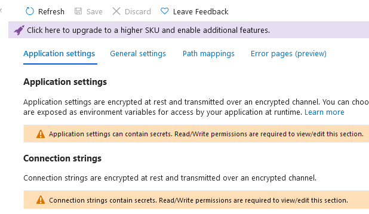

# Introduction

This folder contains bicep template to deploy custom role for Privilege Web App and Function App readier Role. I.e. A Role that gives permission to view/read Application settings and connection strings that are typically protected/hidden from the standard reader role

## Problem

Microsoft protects the Application settings from standard Reader roles deliberately as the settings or connection strings typically contain information that may give write permissions against other resources, e.g. storage account keys are usually stored for function apps and with these keys data can be deleted. It is a good design but there are times when we want to give read access to these settings but not full contributer role over the resource.

## Solution

## Implementation
